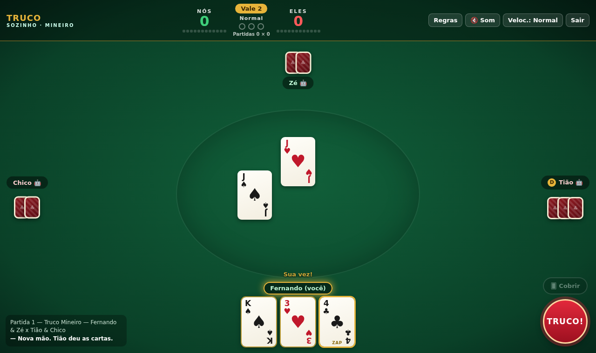
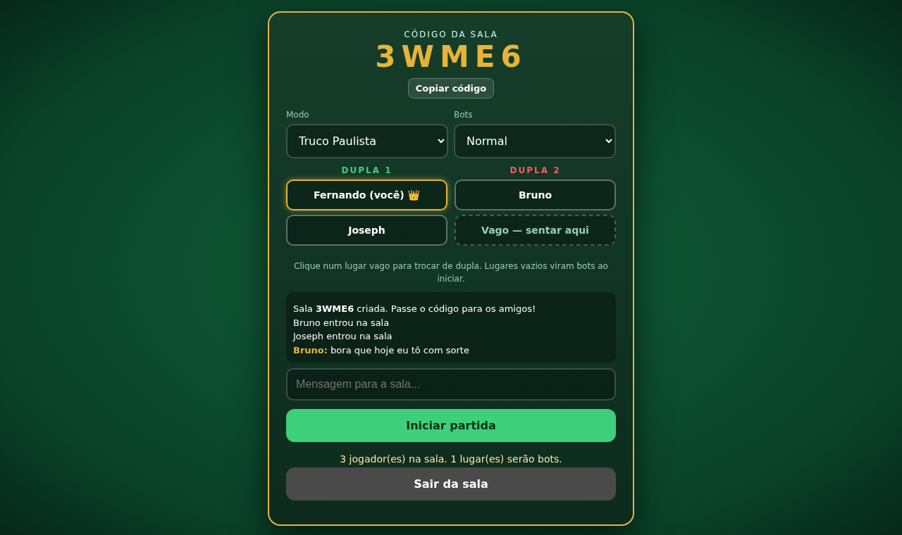
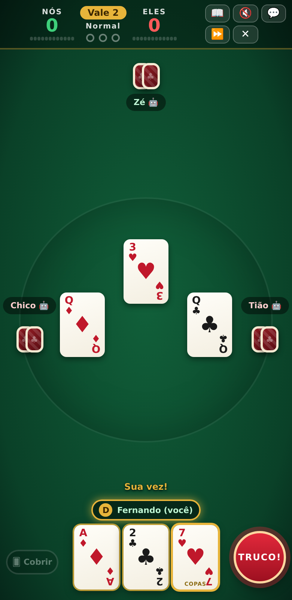
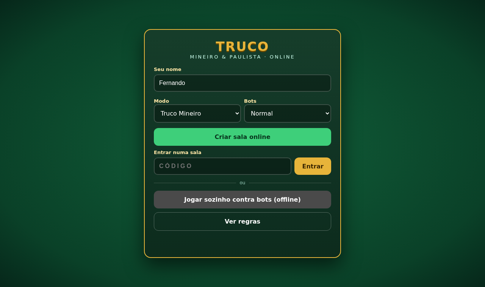

<p align="center">
  
</p>

<p align="center">
  <a href="https://fernandojose-esdhc.github.io/trucoonline/"><b>▶️ JOGAR AGORA</b></a>
  &nbsp;·&nbsp; <a href="#-regras-do-truco-mineiro">Regras do Mineiro</a>
  &nbsp;·&nbsp; <a href="#-regras-do-truco-paulista">Regras do Paulista</a>
  &nbsp;·&nbsp; <a href="#-como-jogar-online">Como jogar online</a>
</p>

<p align="center">
  
  
  
  
</p>

---

# 🃏 Truco Online — Mineiro & Paulista

Truco completo no navegador, feito em **um único arquivo HTML**.
Jogue com os amigos em **salas online sem cadastro** ou **sozinho, offline**, contra bots que contam cartas, blefam e sabem a hora de correr.

Funciona no **PC, Android e iPhone**, sem instalar nada.

<p align="center">
  
</p>

## ✨ Destaques

| | |
|---|---|
| 🌐 **Online com salas** | Crie uma sala, passe o código de 5 letras e jogue. Sem login, sem servidor próprio: os aparelhos se conectam direto (WebRTC). |
| 🎴 **Dois modos** | **Truco Mineiro** (manilhas fixas, mão vale 2) e **Truco Paulista** (vira e manilhas variáveis, mão vale 1). |
| 🤖 **Bots inteligentes** | Três níveis. No Normal e no Difícil eles simulam centenas de jogadas por decisão (Monte Carlo), contam as cartas que já saíram, levam o placar em conta e desconfiam de quem pede truco. |
| 🂠 **Carta coberta** | A partir da 2ª vaza, jogue uma carta virada para esconder o jogo. |
| 🗳️ **Votação no 10×10** | Quando as duas duplas chegam a 10 (ou 11 no Paulista), todos votam: mão de ferro ou mão normal. Empate? Vale o voto de quem tirar a maior carta. |
| 🔌 **Caiu? Volta.** | Se alguém perder a conexão, um bot assume o lugar até a pessoa reconectar. |
| 💬 **Chat na mesa** | As mensagens aparecem em balões em cima de quem falou. |
| 🎬 **Animações** | Distribuição das cartas, carta voando para a mesa, vaza recolhida, tremor no truco e confete na vitória. |

## 📸 Telas

<table>
  <tr>
    <td width="50%"><br><sub><b>Truco Paulista</b>: a vira fica no canto e define a manilha</sub></td>
    <td width="50%"><br><sub><b>Pediram truco!</b> Aceitar, correr ou aumentar (com a dica do parceiro)</sub></td>
  </tr>
  <tr>
    <td><br><sub><b>Sala online</b>: escolha a dupla, o modo e o nível dos bots</sub></td>
    <td><br><sub><b>10 × 10</b>: votação entre mão de ferro e mão normal</sub></td>
  </tr>
</table>

<p align="center">
  
  &nbsp;
  
  &nbsp;
  
</p>

---

## 🚀 Como jogar

### Pelo link (recomendado)
Abra **https://fernandojose-esdhc.github.io/trucoonline/** no navegador do PC ou do celular.

> 📱 **Dica:** no celular, use *Compartilhar → Adicionar à Tela de Início* para abrir como um app, em tela cheia.

### Sozinho, sem internet
Baixe o arquivo [`index.html`](index.html) e abra no navegador (no Android e no PC funciona direto do arquivo). Escolha o modo, o nível dos bots e clique em **Jogar sozinho contra bots**.

### 🌐 Como jogar online
1. Digite seu nome, escolha o modo e clique em **Criar sala online**.
2. Aparece um **código de 5 letras**. Mande para os amigos (ou use **Copiar link**).
3. Os amigos abrem o jogo, digitam o código e clicam em **Entrar**.
4. Cada um clica num lugar vago para escolher a dupla. Lugares vazios viram bots, então dá para jogar com 2, 3 ou 4 pessoas.
5. Quem criou a sala clica em **Iniciar partida**.

> ⚠️ O jogo roda no aparelho de quem criou a sala. Se o anfitrião fechar a página, a sala acaba. De preferência, crie a sala num **PC ou Android**: no iPhone, trocar de app ou bloquear a tela derruba a sala.
> Em algumas redes 4G/corporativas a conexão direta pode ser bloqueada; trocar para Wi-Fi costuma resolver.

### Controles
| Ação | Como |
|---|---|
| Jogar uma carta | Toque/clique na carta quando aparecer **Sua vez!** |
| Pedir truco / aumentar | Botão vermelho **TRUCO!** (vira SEIS!, NOVE!, DOZE!) |
| Jogar coberta | Botão **🂠 Cobrir** e depois a carta (a partir da 2ª vaza) |
| Histórico e chat (celular) | Botão **💬** no topo |

---

## 📖 Regras comuns

- **4 jogadores** em **2 duplas**; os parceiros sentam frente a frente.
- **Baralho de 40 cartas**: sem 8, 9 e 10 (e sem coringas).
- Cada jogador recebe **3 cartas**. Vence a partida quem fizer **12 pontos**.
- Quem começa a mão é o jogador seguinte a quem deu as cartas; nas vazas seguintes, começa quem ganhou a anterior. A cada mão, o próximo jogador dá as cartas.

### Força das cartas comuns
Da mais forte para a mais fraca (o naipe não importa):

```
3  ›  2  ›  A  ›  K  ›  J  ›  Q  ›  7  ›  6  ›  5  ›  4
```

Duas cartas iguais de **duplas diferentes** empatam a vaza ("cangou").

### Vazas (quem leva a mão)
A mão é uma **melhor de 3 vazas**:

| Situação | Quem ganha |
|---|---|
| Uma dupla ganha 2 vazas | Essa dupla |
| Empatou a 1ª | Quem ganhar a 2ª |
| Ganhou a 1ª e empatou a 2ª | Quem ganhou a 1ª |
| 1ª e 2ª divididas, 3ª empatada | Quem ganhou a 1ª |
| Empatou tudo | Ninguém pontua |

### Truco e aumentos
- Na sua vez, **antes de jogar**, você pode pedir **TRUCO**.
- A outra dupla responde: **aceitar** ("Desce!"), **correr** ou **aumentar** (SEIS → NOVE → DOZE).
- Quem **corre** dá para a outra dupla o valor que a mão valia **antes** do pedido.
- A mesma dupla **não pode pedir dois aumentos seguidos**: o próximo aumento é sempre da outra dupla.

### 🂠 Carta coberta
- A partir da **2ª vaza**, na sua vez, você pode jogar uma carta **virada para baixo**.
- A carta coberta **não vale nada**: perde para qualquer carta aberta.
- Ninguém fica sabendo qual carta era. Serve para **esconder o jogo** quando a carta não faria diferença na vaza.
- Na 1ª vaza e na mão de ferro não se cobre.

---

## ⛰️ Regras do Truco Mineiro

**Manilhas fixas** (da mais forte para a mais fraca), acima de todas as outras cartas:

| | Carta | Nome |
|---|---|---|
| 1ª | 4 de paus ♣ | **Zap** |
| 2ª | 7 de copas ♥ | **Copas** (7 copas) |
| 3ª | Ás de espadas ♠ | **Espadilha** |
| 4ª | 7 de ouros ♦ | **Pica-fumo** |

**Pontos:**

| Mão | Vale |
|---|---|
| Normal | **2** |
| TRUCO | 4 |
| SEIS | 8 |
| NOVE | 10 |
| DOZE | 12 |

**Mão de 10:** a dupla que chega a **10 pontos** vê as próprias cartas **e as do parceiro** e decide:
- **Jogar**: a mão vale **4** e ninguém pode trucar;
- **Correr**: a outra dupla ganha **2**.

**10 × 10:** veja [Votação da mão de ferro](#-votação-da-mão-de-ferro-10--10--11--11).

---

## 🌆 Regras do Truco Paulista

**A vira:** depois de dar as cartas, uma carta do monte é virada na mesa. A **manilha** é a carta **seguinte** à vira na ordem:

```
4 → 5 → 6 → 7 → Q → J → K → A → 2 → 3 → (volta ao 4)
```

> Exemplo: saiu **J** na vira → as manilhas são os quatro **K**.
> Saiu **3** na vira → as manilhas são os quatro **4**.

**Entre as manilhas, vale o naipe:**

```
♣ Paus (Zap)  ›  ♥ Copas  ›  ♠ Espadas (Espadilha)  ›  ♦ Ouros (Pica-fumo)
```

**Pontos:**

| Mão | Vale |
|---|---|
| Normal | **1** |
| TRUCO | 3 |
| SEIS | 6 |
| NOVE | 9 |
| DOZE | 12 |

**Mão de 11:** a dupla que chega a **11 pontos** vê as cartas do parceiro e decide:
- **Jogar**: a mão vale **3** e ninguém pode trucar;
- **Correr**: a outra dupla ganha **1**.

**11 × 11:** veja a votação abaixo.

---

## 🗳️ Votação da mão de ferro (10 × 10 / 11 × 11)

Quando **as duas duplas** estão a um passo da vitória (10 × 10 no Mineiro, 11 × 11 no Paulista), antes de dar as cartas **os quatro jogadores votam**:

- 🔥 **Mão de ferro**: todo mundo joga **no escuro**, sem ver as próprias cartas. Sem truco.
- 🃏 **Mão normal**: cartas à vista, sem truco.

A **maioria** decide. Se der **2 × 2**, cada jogador **tira uma carta** do baralho e vale o voto de **quem tirar a maior** (pela força natural 3 › 2 › A › … › 4; em cartas iguais, desempata o naipe ♣ › ♥ › ♠ › ♦).

Quem ganhar essa mão leva a partida.

---

## 🤖 Os bots

| Nível | Como joga |
|---|---|
| **Fácil** | Regras simples, erra de vez em quando, blefa pouco. Bom para aprender. |
| **Normal** | Simula ~160 finais possíveis a cada decisão, conta as cartas já vistas e decide truco pelo valor esperado da partida. |
| **Difícil** | Simula ~450 finais, quase não erra, **segura a manilha** para pegar o adversário, blefa na hora certa e cobre carta para esconder o jogo. |

Os bots também pensam no placar: aceitam truco quando correr entregaria o jogo, e desconfiam de quem pede aumento (mas sabem que às vezes é blefe).

---

## 🛠️ Detalhes técnicos

- **Um arquivo só** (`index.html`): HTML, CSS e JavaScript puros, sem build e sem dependências para o modo offline.
- **Online:** [PeerJS](https://peerjs.com/) (WebRTC) carregado de CDN. O navegador de quem cria a sala é a "mesa": ele roda o jogo e envia a cada jogador **só o que ele pode ver**, então ninguém consegue espiar a mão do outro nem a carta coberta.
- **Sem cadastro e sem banco de dados.** Nome, preferências e histórico de vitórias ficam só no seu navegador (localStorage).
- Testado com partidas simuladas automaticamente (os dois modos, carta coberta, votação, queda e reconexão) e em navegador Chromium, em tela de PC e de celular. Tem ajustes específicos para iPhone (som, zoom, áreas seguras e tela acesa).

### Rodar localmente
```bash
git clone https://github.com/FernandoJose-ESDHC/trucoonline.git
cd trucoonline
# abra o index.html no navegador, ou sirva a pasta:
python -m http.server 8000   # e acesse http://localhost:8000
```

---

## 📄 Licença

[MIT](LICENSE) — use, modifique e compartilhe à vontade.

<p align="center"><sub>Feito por <a href="https://github.com/FernandoJose-ESDHC">@FernandoJose-ESDHC</a>. Bora um truco? 🃏</sub></p>
