<p align="center">
  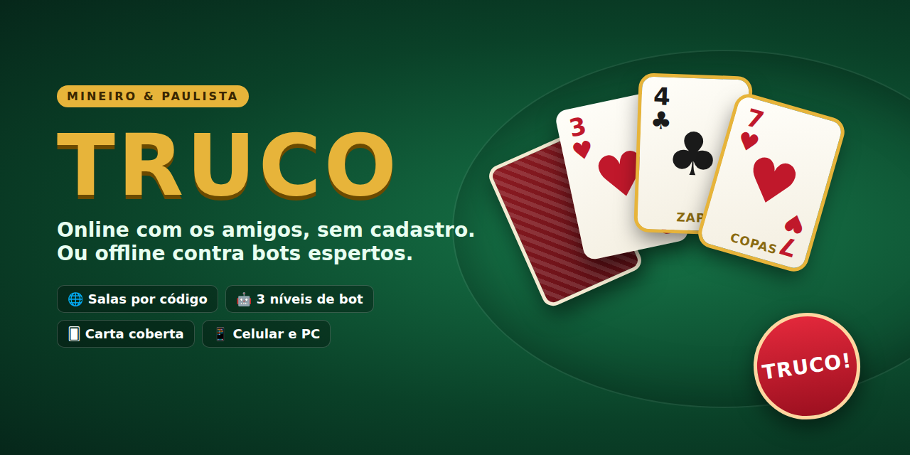
</p>

<p align="center">
  <a href="https://fernandojose-esdhc.github.io/trucoonline/"><b>▶️ JOGAR AGORA</b></a>
  &nbsp;·&nbsp; <a href="#-os-jogos">Os jogos</a>
  &nbsp;·&nbsp; <a href="#-regras">Regras</a>
  &nbsp;·&nbsp; <a href="#-como-jogar-online">Como jogar online</a>
  &nbsp;·&nbsp; <a href="docs/ADICIONAR-JOGO.md">Adicionar um jogo</a>
</p>

<p align="center">
  
  
  
  
</p>

---

# 🎲 Central de Jogos — Truco e muito mais

Uma central de jogos no navegador, feita com HTML, CSS e JavaScript puros.
Jogue com os amigos em **salas online sem cadastro** ou **contra bots**, inclusive sem internet.

Funciona no **PC, Android e iPhone**, sem instalar nada. Também dá para instalar como app (*Compartilhar → Adicionar à Tela de Início*).

📱 **App Android:** [baixe o APK](https://github.com/FernandoJose-ESDHC/trucoonline/releases/download/apk/CentralDeJogos.apk) — os jogos vêm embutidos, funcionam offline contra bots e online com as salas. Ele é gerado automaticamente pelo GitHub a cada atualização ([downloads](https://github.com/FernandoJose-ESDHC/trucoonline/releases/tag/apk)).

<p align="center">
  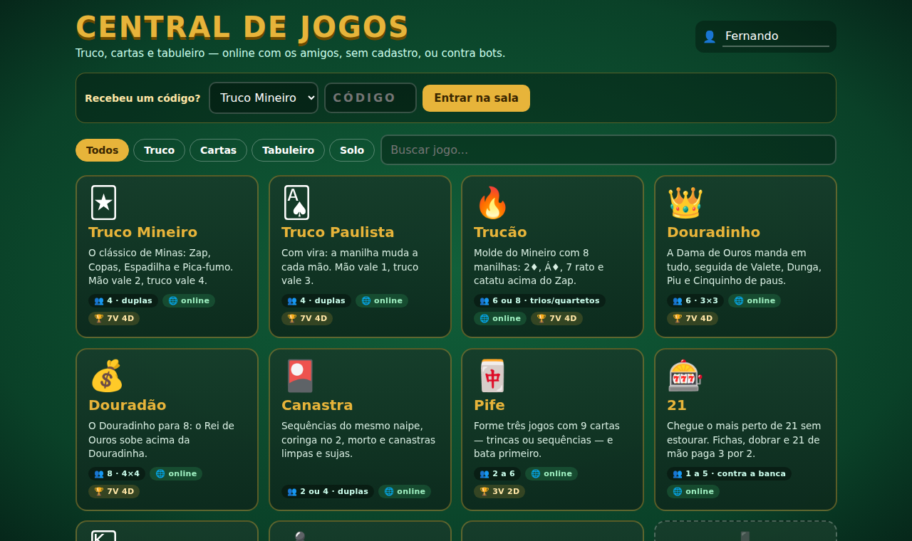
</p>

## 🃏 Os jogos

| | Jogo | Jogadores | Destaque |
|---|---|---|---|
| 🃏 | **[Truco Mineiro](https://fernandojose-esdhc.github.io/trucoonline/games/truco.html?mode=mineiro)** | 4 (duplas) | Manilhas fixas: Zap, Copas, Espadilha e 7 de Ouros |
| 🂡 | **[Truco Paulista](https://fernandojose-esdhc.github.io/trucoonline/games/truco.html?mode=paulista)** | 4 (duplas) | Vira: a manilha muda a cada mão |
| 🔥 | **[Trucão](https://fernandojose-esdhc.github.io/trucoonline/games/truco.html?mode=trucao)** | 6 ou 8 | Molde do Mineiro com 8 manilhas |
| 👑 | **[Douradinho](https://fernandojose-esdhc.github.io/trucoonline/games/truco.html?mode=douradinho)** | 6 (3×3) | A Dama de Ouros acima de tudo |
| 💰 | **[Douradão](https://fernandojose-esdhc.github.io/trucoonline/games/truco.html?mode=douradao)** | 8 (4×4) | O Rei de Ouros acima da Douradinha |
| 🎴 | **[Canastra](https://fernandojose-esdhc.github.io/trucoonline/games/canastra.html)** | 2 ou 4 | Sequências, coringa no 2, morto, canastra limpa e suja |
| 🀄 | **[Pife](https://fernandojose-esdhc.github.io/trucoonline/games/pife.html)** | 2 a 6 | Três jogos com 9 cartas e bata primeiro |
| 🎰 | **[21](https://fernandojose-esdhc.github.io/trucoonline/games/21.html)** | 1 a 5 | Contra a banca, com fichas e dobrar |
| 🂮 | **[Paciência](https://fernandojose-esdhc.github.io/trucoonline/games/paciencia.html)** | 1 | Klondike, virando 1 ou 3, com desfazer |
| ♟️ | **[Xadrez](https://fernandojose-esdhc.github.io/trucoonline/games/xadrez.html)** | 2 | Regras completas, motor próprio em 3 níveis e livro de aberturas |
| ⛀ | **[Damas](https://fernandojose-esdhc.github.io/trucoonline/games/damas.html)** | 2 | Damas brasileiras: lei da maioria e dama voadora |
| 🌈 | **[Última Carta](https://fernandojose-esdhc.github.io/trucoonline/games/ultima.html)** | 2 a 8 | Cartas de cores no estilo do clássico: +2, +4, pular, inverter e "ÚLTIMA!" |
| ⚅ | **[Dominó](https://fernandojose-esdhc.github.io/trucoonline/games/domino.html)** | 4 (duplas) ou 2 a 4 | Duplo-seis em duplas sem compra ou individual com monte |
| 🎲 | **[Ludo](https://fernandojose-esdhc.github.io/trucoonline/games/ludo.html)** | 2 a 4 | Sai com 6, captura manda para a base, casas seguras |
| ⭕ | **[Trilha](https://fernandojose-esdhc.github.io/trucoonline/games/trilha.html)** | 2 | O moinho: coloque, mova, voe e forme trilhas |
| ⚓ | **[Batalha Naval](https://fernandojose-esdhc.github.io/trucoonline/games/batalha.html)** | 2 | Frota escondida de verdade, nem o anfitrião vê |
| 🔘 | **[Reversi](https://fernandojose-esdhc.github.io/trucoonline/games/reversi.html)** | 2 | Cerque e vire as peças; bot com final exato |
| 🔴 | **[Quatro em Linha](https://fernandojose-esdhc.github.io/trucoonline/games/quatro.html)** | 2 | Peças por gravidade; o Difícil é quase perfeito |
| 🟤 | **[Gamão](https://fernandojose-esdhc.github.io/trucoonline/games/gamao.html)** | 2 | Regras completas, gammon e bot com rede neural |
| ⚫ | **[Go](https://fernandojose-esdhc.github.io/trucoonline/games/go.html)** | 2 | 9×9 ou 13×13, ko, contagem chinesa e bot Monte Carlo |
| 🌰 | **[Mancala](https://fernandojose-esdhc.github.io/trucoonline/games/mancala.html)** | 2 | Kalah com 3 a 6 sementes por casa |
| 📍 | **[Resta Um](https://fernandojose-esdhc.github.io/trucoonline/games/restaum.html)** | 1 | Tabuleiro inglês ou francês, com dica que resolve |
| 🔐 | **[Senha](https://fernandojose-esdhc.github.io/trucoonline/games/senha.html)** | 1 | Descubra as cores — ou deixe o computador descobrir a sua |

Todos os jogos de mais de uma pessoa têm **sala online** e **bots** para completar a mesa.

## ✨ Destaques

| | |
|---|---|
| 🌐 **Salas online sem cadastro** | Crie a sala, passe o código de 5 letras (ou o link) e jogue. Os aparelhos se conectam direto (WebRTC), sem servidor próprio. |
| 🤖 **Bots de verdade** | Truco com simulação de centenas de finais por jogada (Monte Carlo, comparando todas as cartas nas mesmas situações), leitura de quem pediu truco e de quem deixou a vaza passar, e apostas pelo placar. Xadrez e Damas com motor próprio (aprofundamento iterativo, tabela de transposição, avaliação de estrutura e finais — o xadrez sabe dar mate só com rei e torre). Canastra e Pife contam as cartas vivas e evitam alimentar o próximo; 21 com a estratégia básica completa e contagem Hi-Lo. Reversi, Trilha, Quatro em Linha e Mancala com busca alfa-beta (finais exatos), Gamão com rede neural treinada, Go com Monte Carlo (MCTS), Dominó e Última Carta lendo o que os outros não têm, Batalha Naval com mapa de probabilidade. |
| 🔌 **Caiu? Volta.** | Se alguém perder a conexão, um bot assume até a pessoa voltar com o mesmo nome. |
| 🙈 **Ninguém espia** | Cada jogador recebe só o que pode ver: cartas dos outros e carta coberta nunca saem do aparelho de quem cria a sala. |
| 📱 **Celular primeiro** | Layout para tela de celular, áreas seguras do iPhone, tela acesa durante o jogo, som liberado no primeiro toque. |
| 📶 **Offline** | Depois da primeira visita, o modo contra bots abre até sem internet. |
| ➕ **Feita para crescer** | Cada jogo é um arquivo. As salas, os bots e a sala de espera vêm prontos ([veja como adicionar](docs/ADICIONAR-JOGO.md)). |

## 📸 Telas

<table>
  <tr>
    <td width="50%">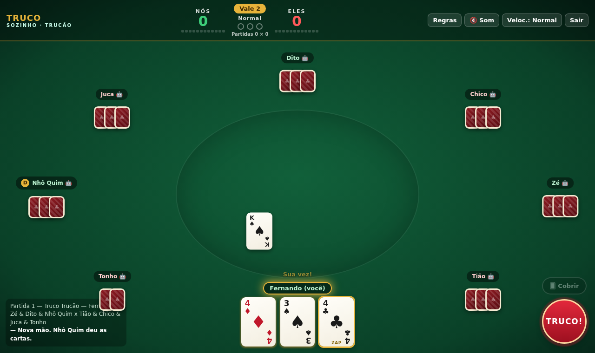<br><sub><b>Trucão / Douradão</b>: mesa para 8, com as manilhas destacadas</sub></td>
    <td width="50%">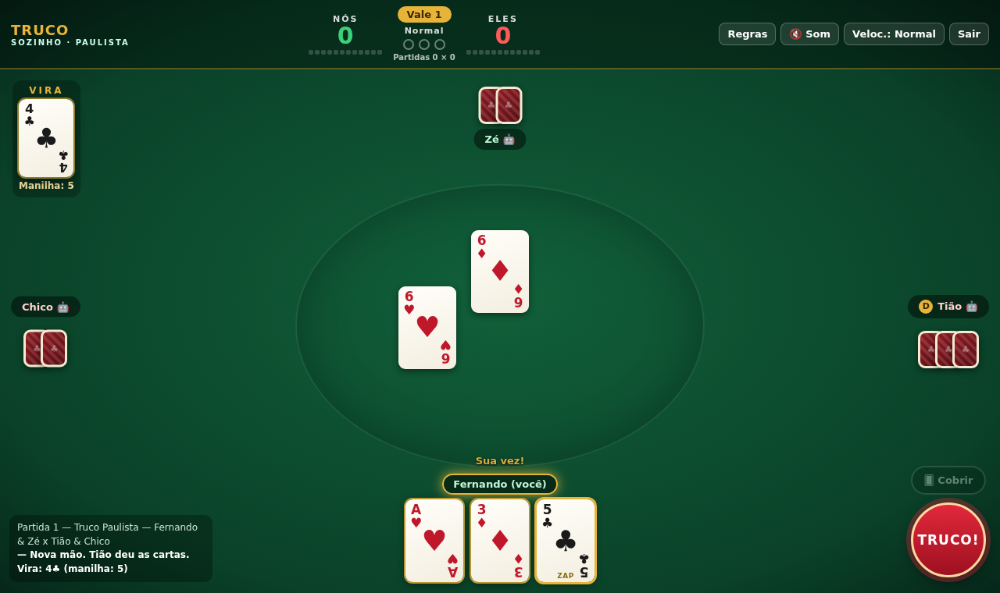<br><sub><b>Truco Paulista</b>: a vira define a manilha</sub></td>
  </tr>
  <tr>
    <td>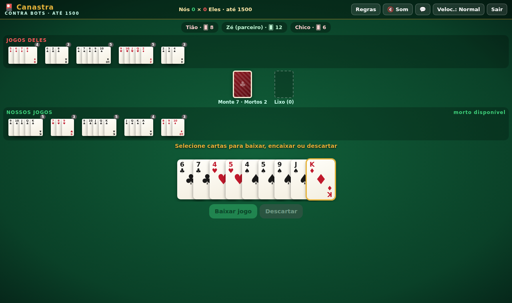<br><sub><b>Canastra</b>: jogos das duas duplas na mesa</sub></td>
    <td>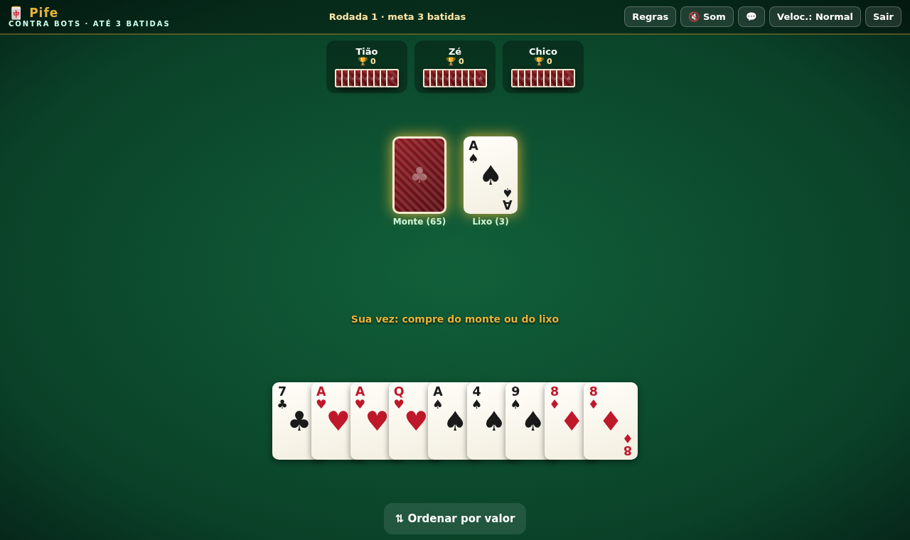<br><sub><b>Pife</b>: as cartas que já formam jogo ficam marcadas</sub></td>
  </tr>
  <tr>
    <td>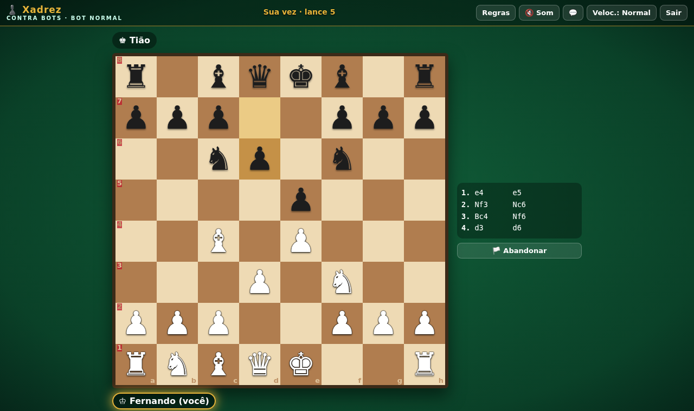<br><sub><b>Xadrez</b>: lances anotados e peças capturadas</sub></td>
    <td>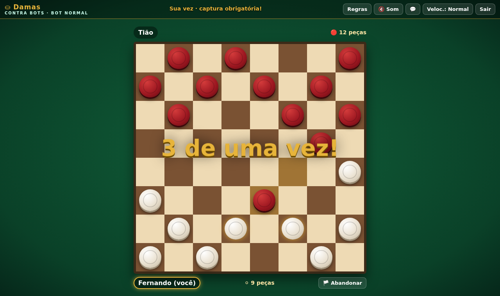<br><sub><b>Damas</b>: as peças que podem jogar piscam</sub></td>
  </tr>
  <tr>
    <td>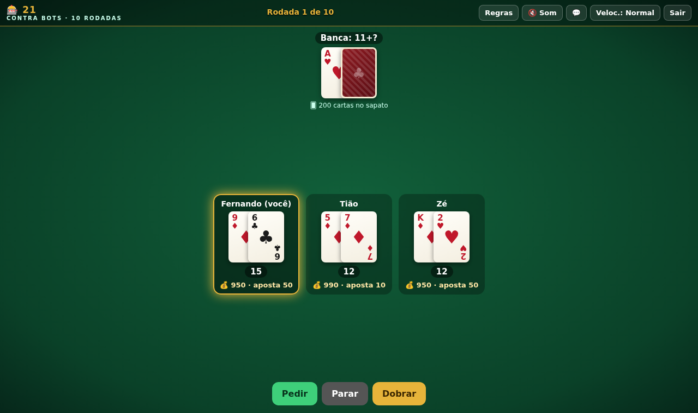<br><sub><b>21</b>: contra a banca, com fichas</sub></td>
    <td>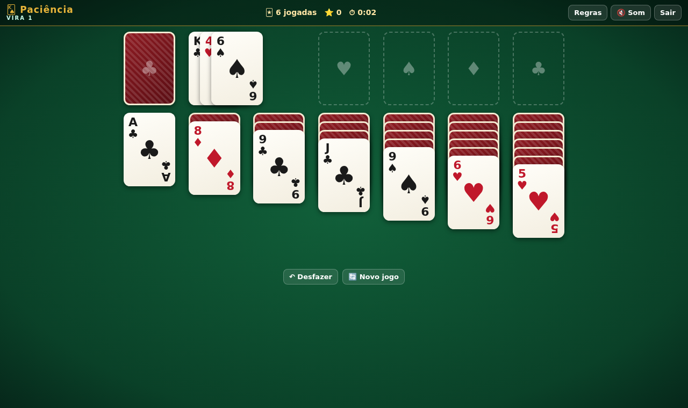<br><sub><b>Paciência</b>: toque na carta e ela vai sozinha para o lugar certo</sub></td>
  </tr>
  <tr>
    <td>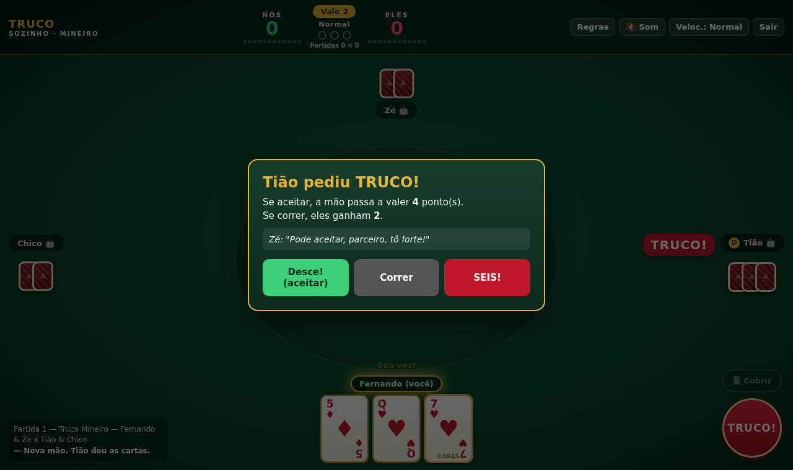<br><sub><b>Pediram truco!</b> Aceitar, correr ou aumentar</sub></td>
    <td>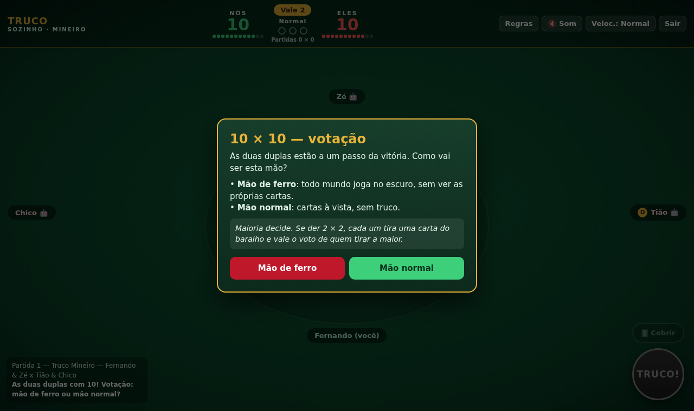<br><sub><b>10 × 10</b>: votação entre mão de ferro e mão normal</sub></td>
  </tr>
</table>

<p align="center">
  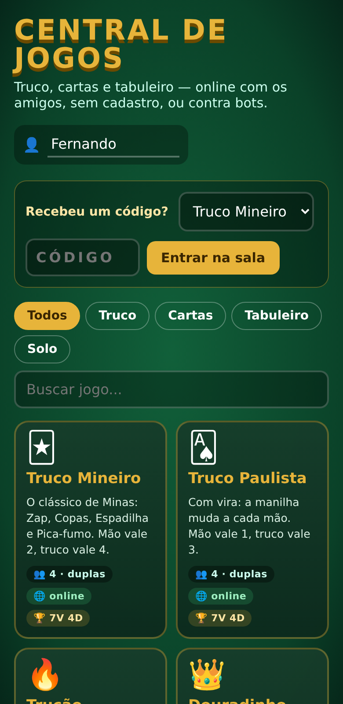
  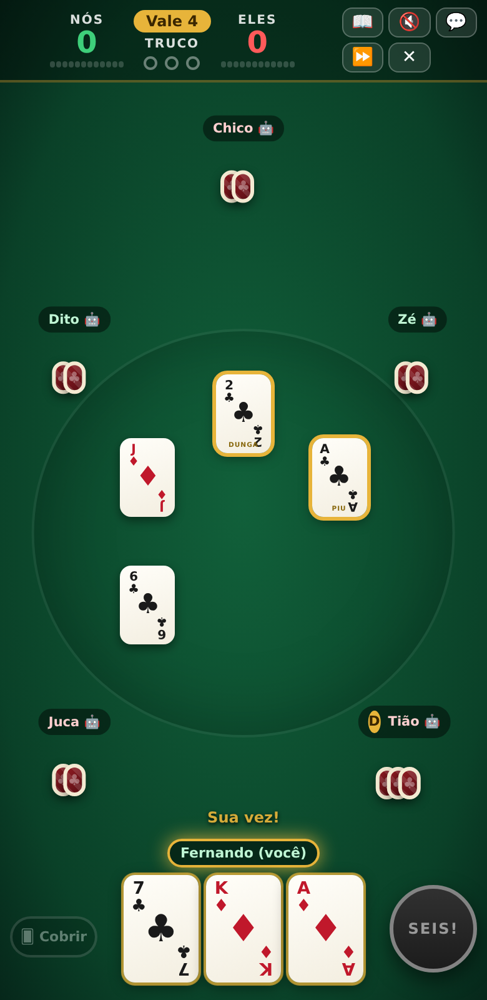
  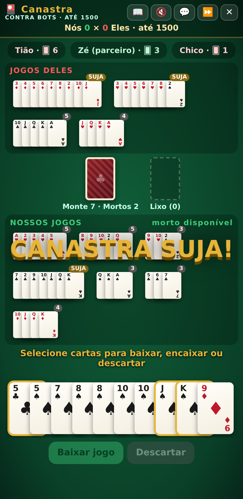
  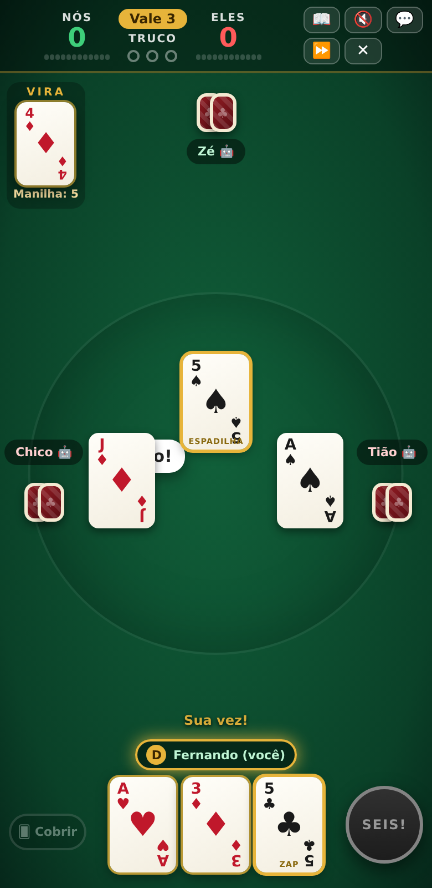
</p>

---

## 🚀 Como jogar

Abra **https://fernandojose-esdhc.github.io/trucoonline/**, escolha o jogo e:

- **Contra bots:** escolha as opções (modo, nível dos bots, nº de jogadores) e toque em **Jogar contra bots**.
- **Online:** veja abaixo.

### 🌐 Como jogar online
1. Digite seu nome, escolha o jogo e as opções e toque em **Criar sala online**.
2. Aparece um **código de 5 letras**. Mande para os amigos (ou use **Copiar link**).
3. Os amigos abrem o mesmo jogo (ou a Central, no campo *Recebeu um código?*), digitam o código e tocam em **Entrar**.
4. Cada um escolhe o lugar/time. Lugares vazios viram bots.
5. Quem criou a sala toca em **Iniciar partida**.

> ⚠️ O jogo roda no aparelho de quem criou a sala: se o anfitrião fechar a página, a sala acaba. De preferência, crie a sala num **PC ou Android** (no iPhone, trocar de app derruba a sala).
> Em algumas redes 4G/corporativas a conexão direta é bloqueada; trocar para Wi-Fi costuma resolver.

---

# 📖 Regras

<details open>
<summary><b>🃏 Truco — regras comuns a todos os modos</b></summary>

- Baralho de **40 cartas** (sem 8, 9 e 10). Cada jogador recebe **3 cartas**. Vence quem fizer **12 pontos**.
- Os jogadores formam **dois times**, sentados alternados (um de cada time em volta da mesa).
- **Cartas comuns**, da mais forte para a mais fraca (o naipe não importa): `3 › 2 › A › K › J › Q › 7 › 6 › 5 › 4`. Acima delas ficam as **manilhas** de cada modo.
- Cartas iguais de times diferentes **empatam** a vaza ("cangou").
- **Vazas** (melhor de 3): empatou a 1ª, leva quem ganhar a 2ª; ganhou a 1ª e empatou outra, leva quem ganhou a 1ª; empatou tudo, ninguém pontua.
- **Truco**: na sua vez, antes de jogar, peça aumento. Quem responde aceita ("Desce!"), corre ou aumenta (SEIS → NOVE → DOZE). Quem corre entrega o valor de antes do pedido. O mesmo time não pede dois aumentos seguidos.
- **Carta coberta**: a partir da 2ª vaza, dá para jogar uma carta **virada para baixo**. Ela não vale nada e ninguém fica sabendo qual era.
- **Mão de 10** (11 no Paulista): o time que chega lá vê as cartas dos parceiros e decide jogar (a mão vale mais e não tem truco) ou correr.
- **10 × 10** (11 × 11): todos **votam** entre **mão de ferro** (todo mundo joga no escuro) e **mão normal** (cartas à vista, sem truco). Empate na votação: cada um tira uma carta e vale o voto de **quem tirar a maior**.

</details>

<details>
<summary><b>⛰️ Truco Mineiro</b> — 4 jogadores</summary>

| Manilha (da mais forte) | Carta |
|---|---|
| **Zap** | 4♣ |
| **Copas** | 7♥ |
| **Espadilha** | A♠ |
| **7 de Ouros** | 7♦ |

Mão normal vale **2**: TRUCO 4 · SEIS 8 · NOVE 10 · DOZE 12. Mão de 10 vale 4; quem corre dela dá 2.
</details>

<details>
<summary><b>🌆 Truco Paulista</b> — 4 jogadores</summary>

Depois de dar as cartas, uma carta é virada na mesa: a **vira**. A **manilha** é a carta seguinte à vira na ordem `4 → 5 → 6 → 7 → Q → J → K → A → 2 → 3 → (4)`.
Ex.: vira **J** → manilhas são os **K**. Entre as manilhas vale o naipe: **♣ Zap › ♥ Copas › ♠ Espadilha › ♦ Ouros**.

Mão normal vale **1**: TRUCO 3 · SEIS 6 · NOVE 9 · DOZE 12. Mão de 11 vale 3; quem corre dela dá 1.
</details>

<details>
<summary><b>🔥 Trucão</b> — 6 (3×3) ou 8 (4×4) jogadores</summary>

Molde do Mineiro, com quatro manilhas acima do Zap:

| # | Carta | Nome |
|---|---|---|
| 1 | 2♦ | 2 de ouro |
| 2 | A♦ | Ás de ouro |
| 3 | 7♣ | 7 rato |
| 4 | 4♠ | Catatau |
| 5 | 4♣ | Zap |
| 6 | 7♥ | Copas |
| 7 | A♠ | Espadilha |
| 8 | 7♦ | 7 de Ouros |

Pontos iguais ao Mineiro.
</details>

<details>
<summary><b>👑 Douradinho</b> (6 jogadores, 3×3) e <b>💰 Douradão</b> (8 jogadores, 4×4)</summary>

| # | Douradinho | Nome |
|---|---|---|
| 1 | Q♦ | Douradinha |
| 2 | J♣ | Valete de paus |
| 3 | 2♣ | Dunga |
| 4 | A♣ | Piu |
| 5 | 5♣ | Cinquinho |
| 6 | 4♣ | Zap |
| 7 | 7♥ | Copas |
| 8 | A♠ | Espadilha |
| 9 | 7♦ | 7 de Ouros |

No **Douradão**, o **K♦ (Rei de Ouros)** fica acima da Douradinha. Pontos iguais ao Mineiro.
</details>

<details>
<summary><b>🎴 Canastra</b> — 2 ou 4 jogadores</summary>

- **Dois baralhos** (104 cartas). 11 cartas para cada; separam-se **dois mortos** de 11 cartas.
- **Jogos**: só **sequências do mesmo naipe** com 3+ cartas (A-2-3 ou Q-K-A valem).
- O **2 é curinga**, no máximo **um por jogo**. Um 2 do mesmo naipe na posição dele é natural.
- **Canastra** = jogo com 7+ cartas: **limpa** (sem curinga) +200, **suja** +100.
- **Sua vez**: compre 1 carta do monte **ou** pegue o lixo inteiro → baixe/encaixe jogos → descarte 1.
- Quem acaba as cartas pega o **morto** do time. Para **bater** (+100), o time precisa ter pego o morto e ter **uma canastra limpa**. Sem isso, guarde pelo menos 2 cartas.
- **Pontos das cartas**: A 15 · 2 10 · 8 a K 10 · 3 a 7 5. Somam as baixadas, diminuem as que sobraram na mão. Time que não pegou o morto perde 100.
- Partida até 1.000, 1.500 ou 3.000 pontos.
</details>

<details>
<summary><b>🀄 Pife</b> — 2 a 6 jogadores</summary>

- **Dois baralhos** sem coringa. Cada um recebe **9 cartas**.
- **Jogos**: **trinca** (3 ou 4 cartas do mesmo valor e naipes diferentes) ou **sequência** (3+ cartas seguidas do mesmo naipe; A-2-3 e Q-K-A valem, K-A-2 não).
- **Sua vez**: compre do monte ou pegue a carta de cima do lixo, depois descarte uma (não vale devolver a que pegou do lixo).
- **Bater**: quando as 9 cartas formam jogos, descarte a 10ª e aperte **Bater!**. Cada batida é 1 ponto; partida até 1, 3 ou 5 batidas.
</details>

<details>
<summary><b>🎰 21</b> — 1 a 5 jogadores contra a banca</summary>

- Cartas: 2 a 10 pelo número, J/Q/K valem 10, Ás vale 11 ou 1.
- Todos apostam (mínimo 10), recebem 2 cartas; a banca tem uma aberta e uma fechada.
- **Pedir**, **Parar** ou **Dobrar** (dobra a aposta e recebe só mais 1 carta). Passou de 21, estourou.
- A banca pede até ter 17 ou mais. Ganhou: recebe a aposta; **21 de mão** paga 3 por 2; empate devolve.
- Todos começam com 1.000 fichas; vence quem tiver mais no fim das rodadas (5, 10 ou 20).
</details>

<details>
<summary><b>🂮 Paciência</b> (Klondike) — 1 jogador</summary>

- Monte as **quatro pilhas** de cada naipe, do **Ás ao Rei**.
- Nas 7 colunas, empilhe em ordem decrescente **alternando cores** (vermelho sobre preto). Só **Rei** vai para coluna vazia.
- Vire do monte **1 ou 3 cartas** por vez.
- Toque numa carta e ela vai sozinha para o melhor lugar. Tem **desfazer** e **completar automático**.
</details>

<details>
<summary><b>♟️ Xadrez</b> — 2 jogadores</summary>

Regras oficiais completas: **roque** (dos dois lados), **en passant**, **promoção** (dama, torre, bispo ou cavalo), **xeque-mate**, e empates por **afogamento**, **3 repetições**, **50 lances** e **material insuficiente**. Contra o computador, escolha a cor e o nível (o Difícil pensa até 1,6 s por lance com motor próprio).
</details>

<details>
<summary><b>⛀ Damas</b> (regras brasileiras) — 2 jogadores</summary>

- Tabuleiro 8×8, só nas casas escuras, 12 pedras para cada. Brancas começam.
- **Pedra** anda 1 casa para frente na diagonal e **captura para frente e para trás**.
- **Captura obrigatória** e **lei da maioria**: é obrigatório o lance que captura mais peças.
- A pedra que **termina** a jogada na última fileira vira **dama**. A dama anda e captura **à distância**.
- Vence quem deixar o adversário sem peças ou sem lances. Empate após 20 lances seguidos de cada lado só com damas e sem captura.
</details>

<details>
<summary><b>🌈 Última Carta</b> — 2 a 8 jogadores</summary>

- Inspirado no clássico jogo de cartas de cores (visual próprio). Baralho de 108 cartas, 7 para cada um.
- Jogue uma carta da **mesma cor, número ou símbolo**. Especiais: **Pular**, **Inverter** (com 2 jogadores vale como Pular), **+2**, **Coringa** (escolhe a cor) e **Coringa +4** (só sem carta da cor da mesa).
- Sem carta que sirva, compra 1; se servir, pode jogar na hora.
- Com 2 cartas, aperte **ÚLTIMA!** antes de jogar — quem fica com 1 carta sem gritar compra 2.
- Opções: acumular +2/+4 e partida de 1 rodada ou até 500 pontos (números pelo valor, ações 20, coringas 50).
</details>

<details>
<summary><b>⚅ Dominó</b> — duplas (4) ou individual (2 a 4)</summary>

- Duplo-seis: 28 pedras, 7 para cada. Encaixe pelo número numa das duas pontas.
- **Duplas:** sem compra; na 1ª mão começa a carroça de seis; quem não tem pedra passa.
- **Individual:** sem pedra que sirva, compra do monte até achar; monte vazio, passa.
- **Batida:** quem esvazia a mão marca a soma das pedras dos adversários. **Trancado:** ganha quem tiver menos pontos na mão.
- Partida até 50, 100 ou 200 pontos.
</details>

<details>
<summary><b>🎲 Ludo</b> — 2 a 4 jogadores</summary>

- Sai da base com **6** (ou, na opção, com 1 ou 6). Tirou 6, joga de novo; **três 6 seguidos** perde a vez.
- Parar sobre peça adversária a **manda para a base** e dá jogada extra. Saídas e estrelas são **casas seguras**.
- Para entrar no centro precisa do número exato. Vence quem levar as 4 peças primeiro.
</details>

<details>
<summary><b>⭕ Trilha</b> (moinho) — 2 jogadores</summary>

- 9 peças cada. Primeiro **coloca**, depois **move** para casa vizinha; com 3 peças, **voa** para qualquer casa vazia.
- Formou **trilha** (3 em linha): tira uma peça adversária que não esteja em trilha (se todas estiverem, qualquer uma).
- Perde quem ficar com 2 peças ou sem lances. Empate por repetição tripla ou 50 lances sem remoção.
</details>

<details>
<summary><b>⚓ Batalha Naval</b> — 2 jogadores</summary>

- Grade 10×10. Frota: porta-aviões (5), encouraçado (4), cruzador (3), submarino (3) e destróier (2). **Navios não se tocam**, nem na diagonal.
- Os dois posicionam ao mesmo tempo (aleatório ou arrastando e girando) e confirmam.
- Tiros alternados; acertou, atira de novo (opção). Navio afundado aparece e as casas em volta viram água.
- Vence quem afundar a frota inteira.
</details>

<details>
<summary><b>🔘 Reversi</b> — 2 jogadores</summary>

- 8×8, quatro peças no centro, pretas começam.
- O lance precisa **cercar e virar** ao menos uma peça adversária (linha, coluna ou diagonal).
- Sem lance, passa a vez. Acaba quando ninguém pode jogar; vence quem tiver mais peças.
</details>

<details>
<summary><b>🔴 Quatro em Linha</b> — 2 jogadores</summary>

- 7 colunas × 6 linhas; a peça cai até a casa livre mais baixa.
- Vence quem fizer **4 em linha** (horizontal, vertical ou diagonal). Tabuleiro cheio é empate.
</details>

<details>
<summary><b>🟤 Gamão</b> — 2 jogadores</summary>

- 15 pedras para cada, andando em sentidos opostos; vence quem **retirar todas** primeiro.
- Cada dado é um movimento (dupla vale 4). Ponto com 2+ pedras adversárias fica bloqueado.
- Pedra sozinha pode ser **batida** e vai para a barra; precisa entrar de novo antes de qualquer outro movimento.
- É obrigatório usar o máximo dos dados (se só der um, o maior). Retirada só com as 15 em casa.
- Partida de 1 jogo ou até 3, 5 ou 7 pontos: **gammon** vale 2 e **backgammon** 3.
</details>

<details>
<summary><b>⚫ Go</b> — 2 jogadores</summary>

- Tabuleiro 9×9 ou 13×13; pretas começam. Grupo sem liberdades é **capturado**; suicídio é proibido.
- **Ko**: nenhuma jogada pode repetir uma posição anterior.
- Dois passes seguidos encerram. Contagem por **área** (pedras vivas + território) com **komi 6,5** para as brancas; as pedras mortas são estimadas automaticamente.
</details>

<details>
<summary><b>🌰 Mancala</b> (Kalah) — 2 jogadores</summary>

- 6 casas por lado e um depósito para cada; 4 sementes por casa (3 a 6 na opção).
- Pegue todas as sementes de uma casa sua e semeie uma por casa no **sentido anti-horário**, pulando o depósito do adversário.
- Última semente no seu depósito: **joga de novo**. Última numa casa sua vazia: **captura** ela e as da frente (se houver).
- Um lado vazio encerra; o outro recolhe o que sobrou. Ganha quem tiver mais no depósito.
</details>

<details>
<summary><b>📍 Resta Um</b> — 1 jogador</summary>

- Tabuleiro inglês (33 casas) ou francês (37). Um pino **pula** sobre o vizinho até uma casa vazia, e o pulado sai.
- Meta: sobrar **um pino** — no centro (ou na ★ do francês) é **Perfeito!**
- Tem desfazer, reiniciar e **dica** com solucionador, que avisa quantas jogadas voltar quando não dá mais.
</details>

<details>
<summary><b>🔐 Senha</b> — 1 jogador</summary>

- Descubra a sequência secreta de cores. **Preto** = cor e lugar certos; **branco** = cor certa no lugar errado.
- Fácil: 4 casas, 6 cores, sem repetir. Normal: com repetição. Difícil: 5 casas, 8 cores, 12 tentativas. Cada cor tem um símbolo (para daltonismo).
- **Dica** sugere a melhor tentativa; no modo "O computador adivinha", você escolhe a senha e ele descobre.
</details>

---

## ➕ Adicionar um jogo

A Central foi pensada para crescer: cada jogo é um arquivo em `games/` que descreve só as regras. Salas online, bots, sala de espera, reconexão e fim de partida vêm prontos da **Mesa** (`shared/mesa.js`).

1. Copie o modelo [`games/modelo-jogo-da-velha.html`](games/modelo-jogo-da-velha.html) (um jogo da velha completo, online e com bot).
2. Troque as regras.
3. Acrescente uma linha em [`games/registry.js`](games/registry.js).

O passo a passo completo está em **[docs/ADICIONAR-JOGO.md](docs/ADICIONAR-JOGO.md)**.

## 🛠️ Detalhes técnicos

```
index.html            → a Central (lista de jogos, busca, entrar com código)
games/registry.js     → lista dos jogos (é só adicionar uma linha)
games/*.html          → um arquivo por jogo
shared/core.js|css    → cartas, sons, modais, animações, estatísticas
shared/mesa.js        → salas online + bots + sala de espera para qualquer jogo
shared/melds.js       → trincas/sequências (Pife) e canastras
sw.js, manifest.json  → funciona offline e pode ser instalado como app
android/              → app Android (WebView com os jogos embutidos)
.github/workflows/    → compila o APK e publica em Releases a cada atualização
```

- HTML, CSS e JavaScript puros, **sem build e sem dependências** (só o [PeerJS](https://peerjs.com/) para o online).
- O navegador de quem cria a sala é a "mesa": ele roda o jogo e manda a cada jogador **só o que ele pode ver**.
- Sem cadastro e sem banco de dados: nome, preferências e histórico ficam só no seu navegador.
- Testado com partidas simuladas inteiras de cada jogo (bots contra bots), salas online simuladas com queda e reconexão, e validação do gerador de lances do xadrez (*perft*) e das damas.
- Cada versão nova dos bots joga centenas de partidas contra a anterior antes de entrar.

### Rodar localmente
```bash
git clone https://github.com/FernandoJose-ESDHC/trucoonline.git
cd trucoonline
python -m http.server 8000   # e acesse http://localhost:8000
```

## 📄 Licença

[MIT](LICENSE) — use, modifique e compartilhe à vontade.

<p align="center"><sub>Feito por <a href="https://github.com/FernandoJose-ESDHC">@FernandoJose-ESDHC</a>. Bora um truco? 🃏</sub></p>
